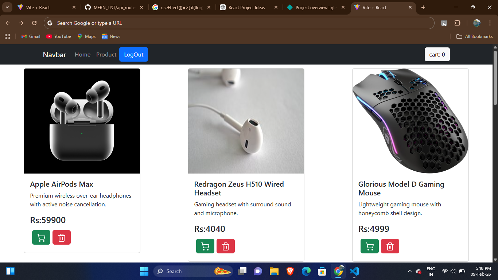

# Shopping Cart
### link https://gleeful-churros-262e03.netlify.app/

## Screenshot

### Uses 
**`useState`**,**`useEffect`**,**`localstorage`**,**`Propsdrilling`**

1. Make a product listing
2. In Navbar added a cart functionality
3. when we click the add to cart button it simply added into cart
4.  Context data contain a  **`addToCart`**,`removeItem`,totalPrice         functionality which help to transfer all the data to every component 
5.  Proper **Proctected** Routed for Cart means User without login can not be access the cart router or cart item
6.  Implemented login and Registration
   
## Love to build Things
Author
### Arvind Vishwakarma